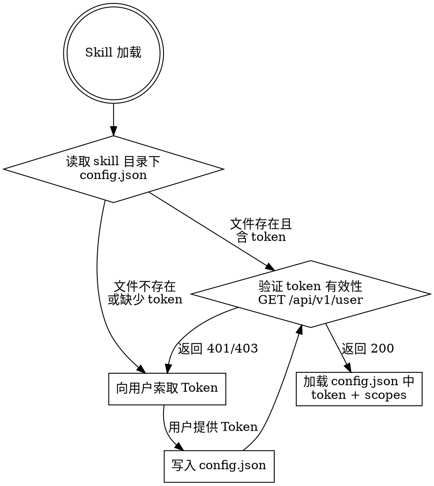

# sm-gitea

## 初始化检查（每次加载必执行）

Gitea 地址固定为 `https://git.8848top.com`，用户只需提供 Token 和权限列表。



**检查步骤：**

1. **读取配置**：尝试读取 skill 目录下的 `config.json`
2. **校验字段**：必须包含 `token`，`scopes` 可选
3. **验证连通性**：`GET https://git.8848top.com/api/v1/user` 验证 token 是否有效
4. **失败处理**：配置缺失或 token 无效时，用以下话术向用户索取：

> 该 Gitea skill 尚未配置 Token。请提供：
> 1. **API Token**（在 git.8848top.com 的 设置 → 应用 → 管理 Access Token 中生成）
>
> 可选：token 的权限列表（如 `read:user,write:repository`），如不确定我会自动检测。

5. **写入配置**：用户提供后，写入 `config.json` 并重新验证
6. **自动检测 scopes**：如果用户未提供 scopes，从 403 响应的 `token scope=...` 中解析

**config.json 格式：**

```json
{
  "token": "your-api-token",
  "scopes": ["read:user", "write:repository"]
}
```

- `token`：API Access Token（必填）
- `scopes`：Token 权限列表（可选，未提供时自动检测）

## 概述

管理私有部署的 Gitea 实例（git.8848top.com），通过 REST API 操作仓库、用户、组织和 Issue。

## 认证

所有 API 请求使用 config.json 中的 token：

```bash
curl -s -H "Authorization: token ${TOKEN}" "https://git.8848top.com/api/v1/..."
```

## Token 权限与能力映射

根据 `config.json` 中的 `scopes` 判断可用操作（地址固定 git.8848top.com，无需配置）：

| Scope | 能做 | 不能做 |
|-------|------|--------|
| `read:user` | 查询用户信息、搜索用户 | 创建/编辑用户（需 write:user） |
| `read:organization` | 查看组织、成员、团队 | 创建仓库（需 write:organization） |
| `write:repository` | **编辑**仓库设置 | 在用户/组织下**创建**仓库（需 write:user 或 write:organization） |
| `read:issue` | 查看 Issue、PR、评论 | 创建/编辑 Issue（需 write:issue） |
| `write:issue` | 创建 Issue/PR、添加评论 | |
| `read:package` | 查看包列表 | 上传/删除包 |
| `write:package` | 上传包 | |
| `write:user` | 创建仓库（用户命名空间下） | |
| `write:organization` | 创建仓库（组织下）、管理团队 | |
| `read:admin` | 查看 admin 级别信息 | |
| `write:admin` | 管理用户、全局设置 | |

**权限检测规则**：执行写操作前，检查 scopes 是否包含所需权限。如果缺少，提示用户：
> 该操作需要 `{scope}` 权限，当前 token 权限为 `{current_scopes}`。请到 Gitea 设置中生成包含该权限的新 token。

## 快速参考

### 仓库操作

| 操作 | 方法 | 端点 | 所需权限 |
|------|------|------|---------|
| 搜索仓库 | GET | `/repos/search?keyword=&user=&limit=&page=` | 无 |
| 仓库详情 | GET | `/repos/{owner}/{repo}` | 无 |
| **编辑仓库** | PATCH | `/repos/{owner}/{repo}` | write:repository |
| 仓库分支 | GET | `/repos/{owner}/{repo}/branches` | 无 |
| 仓库标签(git) | GET | `/repos/{owner}/{repo}/tags` | 无 |
| 仓库 Release | GET | `/repos/{owner}/{repo}/releases` | 无 |
| 仓库 Webhook | GET | `/repos/{owner}/{repo}/hooks` | 无 |
| 仓库协作者 | GET | `/repos/{owner}/{repo}/collaborators` | 无 |
| 组织仓库列表 | GET | `/orgs/{org}/repos?limit=&page=` | 无 |
| 仓库语言统计 | GET | `/repos/{owner}/{repo}/languages` | 无 |
| 仓库文件内容 | GET | `/repos/{owner}/{repo}/contents/{path}?ref=` | 无 |

### 用户与组织

| 操作 | 方法 | 端点 | 所需权限 |
|------|------|------|---------|
| 当前用户 | GET | `/user` | read:user |
| 搜索用户 | GET | `/users/search?q=&limit=` | read:user |
| 用户详情 | GET | `/users/{username}` | read:user |
| 我的组织 | GET | `/user/orgs` | read:organization |
| 组织详情 | GET | `/orgs/{org}` | read:organization |
| 组织成员 | GET | `/orgs/{org}/members` | read:organization |
| 组织团队 | GET | `/orgs/{org}/teams` | read:organization |
| 团队成员 | GET | `/teams/{id}/members` | read:organization |
| 团队仓库 | GET | `/teams/{id}/repos` | read:organization |
| 检查成员关系 | GET | `/orgs/{org}/members/{username}` → 204/404 | read:organization |

### Issue 与 PR

| 操作 | 方法 | 端点 | 所需权限 |
|------|------|------|---------|
| 全局搜索 Issue | GET | `/repos/issues/search?state=&type=&limit=` | read:issue |
| 仓库 Issue 列表 | GET | `/repos/{owner}/{repo}/issues?state=&labels=&limit=` | read:issue |
| Issue 详情 | GET | `/repos/{owner}/{repo}/issues/{index}` | read:issue |
| Issue 评论 | GET | `/repos/{owner}/{repo}/issues/{index}/comments` | read:issue |
| PR 列表 | GET | `/repos/{owner}/{repo}/pulls?state=&limit=` | read:issue |
| PR 详情 | GET | `/repos/{owner}/{repo}/pulls/{index}` | read:issue |
| PR Diff | GET | `/repos/{owner}/{repo}/pulls/{index}.diff`（Accept: application/vnd.gitea.diff） | read:issue |
| PR 文件变更 | GET | `/repos/{owner}/{repo}/pulls/{index}/files` | read:issue |
| 标签 | GET | `/repos/{owner}/{repo}/labels` | read:issue |
| 里程碑 | GET | `/repos/{owner}/{repo}/milestones` | read:issue |

### 包管理

| 操作 | 方法 | 端点 | 所需权限 |
|------|------|------|---------|
| 用户/组织包 | GET | `/packages/{owner}?type=&limit=` | read:package |
| 包详情 | GET | `/packages/{owner}/{type}/{name}/{version}` | read:package |

## 常用工作流

### 查找仓库

```bash
curl -s -H "Authorization: token ${TOKEN}" \
  "https://git.8848top.com/api/v1/repos/search?limit=50"
```

### 编辑仓库设置

```bash
curl -s -X PATCH \
  -H "Authorization: token ${TOKEN}" \
  -H "Content-Type: application/json" \
  "https://git.8848top.com/api/v1/repos/{owner}/{repo}" \
  -d '{"description":"新描述","website":"https://example.com"}'
```

### 查询用户和组织

```bash
curl -s -H "Authorization: token ${TOKEN}" \
  "https://git.8848top.com/api/v1/users/search?q=chen&limit=10"
```

### 获取 PR Diff

```bash
curl -s -H "Authorization: token ${TOKEN}" \
  -H "Accept: application/vnd.gitea.diff" \
  "https://git.8848top.com/api/v1/repos/{owner}/{repo}/pulls/{index}.diff"
```

## 分页与过滤

所有列表接口支持通用分页参数：
- `page`: 页码（从 1 开始）
- `limit`: 每页数量（默认 30，最大 50）

常见过滤参数：
- `state`: `open` | `closed` | `all`（Issue/PR）
- `type`: `issues` | `pulls`（Issue 搜索）
- `sort`: `created` | `updated` | `comments`（Issue）
- `order`: `asc` | `desc`

## 深入参考

| 主题 | 文件 | 何时查看 |
|------|------|---------|
| 仓库管理完整 API | [references/repo-api.md](references/repo-api.md) | 编辑仓库、管理分支/Webhook |
| 用户与组织完整 API | [references/user-org-api.md](references/user-org-api.md) | 查询用户、组织、团队详情 |
| Issue 与 PR 完整 API | [references/issue-api.md](references/issue-api.md) | Issue 搜索、PR 查看、标签管理 |

## 注意事项

- API 返回 JSON，分页信息在响应头 `X-Total-Count` 中
- 所有时间字段为 ISO 8601 格式（如 `2026-04-24T17:54:29+08:00`）
- 仓库路径格式：`{owner}/{repo}`（owner 可以是用户名或组织名）
- 执行任何操作前，始终检查 `config.json` 中 token 的权限是否满足
